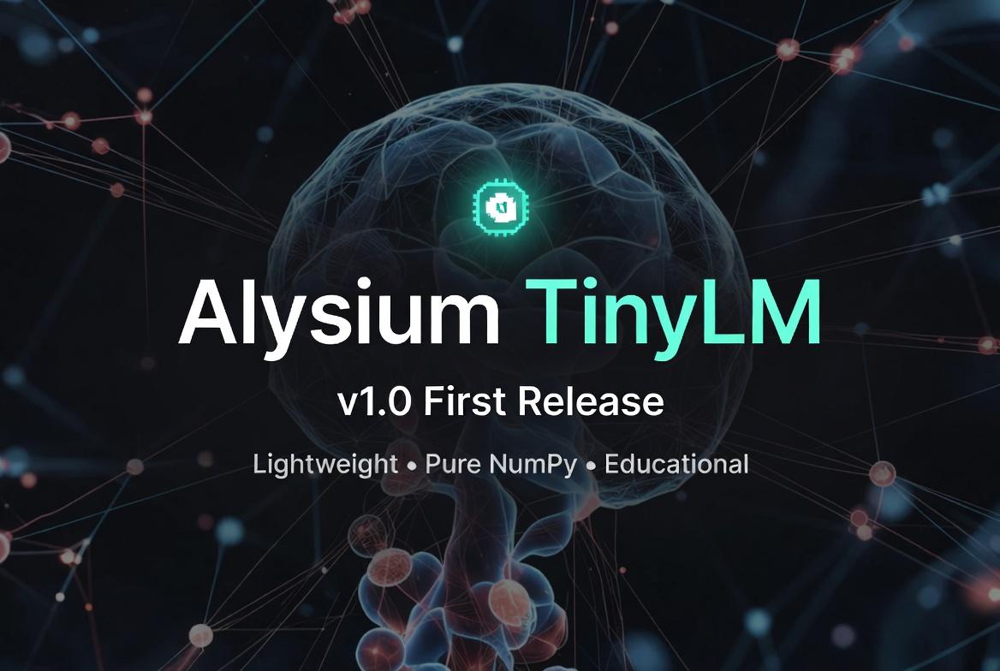

# Neuraprompt AI

**Lightweight AI tools for everyone**

Official project by **Andile Mtolo** (Toxic Dee Modder)  
Founder & CEO of **Alysium Corp Studios ZA**

---

## About

Neuraprompt AI is a platform focused on building accessible, lightweight artificial intelligence tools. It is developed under Alysium Corp Studios ZA, a South African technology initiative founded by Andile Mtolo.

The goal is to make AI experimentation and tools available even on limited hardware, while keeping everything open and easy to understand.

---

## Featured Projects

### Alysium TinyLM
A pure NumPy educational language model.  
Lightweight, transparent, and designed for learning how language models work.

- [GitHub Repository](https://github.com/alysiumcorporationstudios/AlysiumTinyLLM)

---

## Quick Links

| Platform       | Link |
|----------------|------|
| Website        | [neura-prompt-ai.vercel.app](https://neura-prompt-ai.vercel.app) |
| Telegram       | [t.me/alysium_updates](https://t.me/alysium_updates) |
| Instagram      | [@iam_realtoxicdeemodder](https://www.instagram.com/iam_realtoxicdeemodder) |
| X (Twitter)    | [@AlysiumCorpZA](https://x.com/AlysiumCorpZA) |
| GitHub         | [AlysiumTinyLLM](https://github.com/alysiumcorporationstudios/AlysiumTinyLLM) |

---

## About the Founder

**Andile Mtolo** (known as Toxic Dee Modder) is a developer and entrepreneur from South Africa. He is the founder of Alysium Corp Studios ZA and the creator of Neuraprompt AI.

---

## Contact & Community

- Telegram Channel: [Alysium Updates](https://t.me/alysium_updates)
- Instagram: [@iam_realtoxicdeemodder](https://www.instagram.com/iam_realtoxicdeemodder)
- X: [@AlysiumCorpZA](https://x.com/AlysiumCorpZA)

---

**Built with passion in South Africa**
